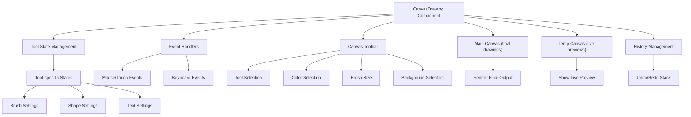

### MINTH Canvas: Developer Documentation

## Table of Contents

1. [Architecture Overview](#architecture-overview)
2. [Component Structure](#component-structure)
3. [Canvas Rendering System](#canvas-rendering-system)
4. [Tool Implementation](#tool-implementation)
5. [State Management](#state-management)
6. [Event Handling](#event-handling)
7. [History Management](#history-management)
8. [Special Features](#special-features)
9. [Integration Points](#integration-points)
10. [Extending the Canvas](#extending-the-canvas)

## Architecture Overview

The MINTH Canvas is built on HTML5 Canvas with React hooks for state management. It uses a dual-canvas approach for performance optimization: a main canvas for finalized drawings and a temporary canvas for real-time previews.



## Component Structure

### Key Files

- `components/canvas/CanvasDrawing.tsx`: Main canvas component
- `components/canvas/CanvasToolbar.tsx`: UI controls for the canvas
- `types/canvas.ts`: TypeScript types for canvas operations

### CanvasDrawing Component

The `CanvasDrawing` component is the core of the canvas system. It:

1. Manages canvas rendering contexts
2. Handles all drawing operations
3. Manages tool states
4. Processes user interactions
5. Implements history management

```typescript
// Main component structure
export default function CanvasDrawing({
  onImageGenerated,
}: CanvasDrawingProps) {
  // Canvas refs
  const canvasRef = useRef<HTMLCanvasElement>(null);
  const tempCanvasRef = useRef<HTMLCanvasElement>(null);

  // Contexts
  const [ctx, setCtx] = useState<CanvasRenderingContext2D | null>(null);
  const [tempCtx, setTempCtx] = useState<CanvasRenderingContext2D | null>(null);

  // Tool states and other state variables...

  // Event handlers, rendering functions, etc...
}
```

### CanvasToolbar Component

The `CanvasToolbar` component provides the UI for selecting tools, colors, brush sizes, and backgrounds.

```typescript
export default function CanvasToolbar({
  currentTool,
  setCurrentTool,
  currentColor,
  setCurrentColor,
  brushSize,
  setBrushSize,
}: // Other props...
CanvasToolbarProps) {
  // UI rendering and event handlers...
}
```

## Canvas Rendering System

### Dual Canvas Approach

The canvas uses two HTML5 canvases stacked on top of each other:

1. **Main Canvas**: Stores the permanent drawing
2. **Temporary Canvas**: Shows real-time previews during drawing operations

This approach improves performance by avoiding redrawing the entire canvas for every mouse movement.

```typescript
// Canvas initialization
useEffect(() => {
  const canvas = canvasRef.current;
  const tempCanvas = tempCanvasRef.current;

  if (!canvas || !tempCanvas) return;

  // Set canvas size based on container
  // ...

  const context = canvas.getContext("2d", { willReadFrequently: true });
  const tempContext = tempCanvas.getContext("2d", { willReadFrequently: true });

  // Configure contexts
  // ...
}, []);
```

### Canvas Operations

Common canvas operations are abstracted into helper functions:

```typescript
// Clear the temporary canvas
const clearTempCanvas = useCallback(() => {
  if (!tempCtx || !tempCanvasRef.current) return;
  tempCtx.clearRect(
    0,
    0,
    tempCanvasRef.current.width,
    tempCanvasRef.current.height
  );
}, [tempCtx]);

// Apply the temporary canvas to the main canvas
const applyTempCanvas = useCallback(() => {
  if (!ctx || !tempCtx || !canvasRef.current || !tempCanvasRef.current) return;
  ctx.drawImage(tempCanvasRef.current, 0, 0);
  clearTempCanvas();
}, [ctx, tempCtx, clearTempCanvas]);
```

## Tool Implementation

### Tool Types

The canvas supports multiple drawing tools defined in `types/canvas.ts`:

```typescript
export type CanvasTool =
  | "brush"
  | "eraser"
  | "line"
  | "rectangle"
  | "circle"
  | "polygon"
  | "text"
  | "fill"
  | "eyedropper"
  | "selection";
```

### Tool-Specific States

Each tool has its own state management to track its specific properties:

```typescript
// Example: Line tool state
const [lineToolState, setLineToolState] = useState<LineToolState>({
  startX: 0,
  startY: 0,
  endX: 0,
  endY: 0,
  isDrawing: false,
  shiftKey: false,
});

// Example: Shape tool state
const [shapeToolState, setShapeToolState] = useState<ShapeToolState>({
  startX: 0,
  startY: 0,
  endX: 0,
  endY: 0,
  isDrawing: false,
  isFilled: false,
  shiftKey: false,
});

// Other tool states...
```

### Tool Implementation Pattern

Each tool follows a similar implementation pattern:

1. **Start**: Handle mousedown/touchstart events
2. **Draw**: Handle mousemove/touchmove events
3. **Stop**: Handle mouseup/touchend/mouseleave events

```typescript
// Example: Rectangle tool implementation
case "rectangle":
  if (shapeToolState.isDrawing) {
    // Clear the temp canvas
    clearTempCanvas()

    // Calculate end point (constrained if shift is pressed)
    let endX = x
    let endY = y

    if (isShiftPressed || shapeToolState.shiftKey) {
      const constrained = calculateConstrainedRect(shapeToolState.startX, shapeToolState.startY, x, y)
      endX = constrained.x
      endY = constrained.y
    }

    // Calculate rectangle dimensions
    const width = endX - shapeToolState.startX
    const height = endY - shapeToolState.startY

    // Draw the rectangle preview
    tempCtx.beginPath()
    tempCtx.rect(shapeToolState.startX, shapeToolState.startY, width, height)

    if (shapeToolState.isFilled) {
      tempCtx.fill()
    } else {
      tempCtx.stroke()
    }

    // Update shape state
    setShapeToolState((prev) => ({
      ...prev,
      endX,
      endY,
      shiftKey: isShiftPressed,
    }))
  }
  break
```

## State Management

### Main State Variables

The canvas manages several types of state:

1. **Tool Selection**: Current active tool
2. **Drawing Properties**: Color, brush size, fill mode
3. **Canvas State**: Size, background
4. **Tool-Specific States**: Properties for each tool
5. **History**: For undo/redo functionality

```typescript
// Tool selection
const [currentTool, setCurrentTool] = useState<CanvasTool>("brush");

// Drawing properties
const [currentColor, setCurrentColor] = useState("#00f5ff");
const [brushSize, setBrushSize] = useState(10);
const [isFilled, setIsFilled] = useState(false);

// Canvas state
const [canvasSize, setCanvasSize] = useState({ width: 800, height: 600 });
const [currentBackground, setCurrentBackground] = useState("canvas");

// Drawing state
const [isDrawing, setIsDrawing] = useState(false);

// History management
const [history, setHistory] = useState<CanvasHistory[]>([]);
const [redoStack, setRedoStack] = useState<CanvasHistory[]>([]);
```

### State Updates

State updates follow React's immutable update pattern:

```typescript
// Example: Updating polygon state
setPolygonToolState((prev) => ({
  ...prev,
  points: [...prev.points, { x, y }],
  tempEndX: x,
  tempEndY: y,
}));
```

## Event Handling

### Mouse and Touch Events

The canvas handles both mouse and touch events for cross-device compatibility:

```typescript
// Canvas event listeners
<canvas
  ref={canvasRef}
  width={canvasSize.width}
  height={canvasSize.height}
  className="relative z-10 touch-none shadow-2xl shadow-cyan-500/10 border border-gray-800/50 rounded-lg"
  onMouseDown={startDrawing}
  onMouseMove={draw}
  onMouseUp={stopDrawing}
  onMouseLeave={stopDrawing}
  onTouchStart={startDrawing}
  onTouchMove={draw}
  onTouchEnd={stopDrawing}
/>
```

### Pointer Position Calculation

Mouse/touch positions are normalized to canvas coordinates:

```typescript
// Get mouse/touch position relative to canvas
const getPointerPosition = useCallback(
  (
    e:
      | React.MouseEvent<HTMLCanvasElement>
      | React.TouchEvent<HTMLCanvasElement>
      | MouseEvent
      | TouchEvent
  ) => {
    if (!canvasRef.current) return { x: 0, y: 0 };

    const rect = canvasRef.current.getBoundingClientRect();
    let x, y;

    if ("touches" in e) {
      // Touch event
      x = e.touches[0].clientX - rect.left;
      y = e.touches[0].clientY - rect.top;
    } else {
      // Mouse event
      x = ("clientX" in e ? e.clientX : e.nativeEvent.clientX) - rect.left;
      y = ("clientY" in e ? e.clientY : e.nativeEvent.clientY) - rect.top;
    }

    return { x, y };
  },
  []
);
```

### Keyboard Shortcuts

The canvas implements keyboard shortcuts using the `react-hotkeys-hook` library:

```typescript
// Tool shortcuts
useHotkeys("b", () => setCurrentTool("brush"), { enableOnFormTags: false });
useHotkeys("e", () => setCurrentTool("eraser"), { enableOnFormTags: false });
useHotkeys("l", () => setCurrentTool("line"), { enableOnFormTags: false });
// Other shortcuts...

// Action shortcuts
useHotkeys("ctrl+z", handleUndo, { enableOnFormTags: true });
useHotkeys("ctrl+y", handleRedo, { enableOnFormTags: true });
```

### Modifier Keys

Modifier keys (like Shift) are tracked for special drawing operations:

```typescript
// Handle key events for shift key
useEffect(
  () => {
    const handleKeyDown = (e: KeyboardEvent) => {
      if (e.key === "Shift") {
        if (currentTool === "line" && lineToolState.isDrawing) {
          setLineToolState((prev) => ({ ...prev, shiftKey: true }));
        } else if (
          (currentTool === "rectangle" || currentTool === "circle") &&
          shapeToolState.isDrawing
        ) {
          setShapeToolState((prev) => ({ ...prev, shiftKey: true }));
        }
      }
      // Other key handlers...
    };

    // Add event listeners...
  },
  [
    /* dependencies */
  ]
);
```

## History Management

### Canvas State Storage

The canvas stores its state as data URLs for undo/redo operations:

```typescript
// Save canvas state for undo/redo
const saveCanvasState = useCallback(() => {
  if (!canvasRef.current) return;

  const canvas = canvasRef.current;
  const imageData = canvas.toDataURL("image/png");

  setHistory((prev) => {
    // Limit history to 20 steps
    const newHistory = [...prev, { imageData }];
    if (newHistory.length > 20) {
      return newHistory.slice(newHistory.length - 20);
    }
    return newHistory;
  });

  // Clear redo stack when new action is performed
  setRedoStack([]);
}, []);
```

### Undo/Redo Implementation

Undo and redo operations restore previous canvas states:

```typescript
// Handle undo
function handleUndo() {
  if (history.length <= 1) return;

  const newHistory = [...history];
  const lastState = newHistory.pop();

  if (lastState) {
    setRedoStack((prev) => [...prev, lastState]);
  }

  setHistory(newHistory);

  if (newHistory.length > 0 && canvasRef.current && ctx) {
    const img = new Image();
    img.crossOrigin = "anonymous";
    img.src = newHistory[newHistory.length - 1].imageData;
    img.onload = () => {
      ctx.clearRect(0, 0, canvasRef.current!.width, canvasRef.current!.height);
      ctx.drawImage(img, 0, 0);
    };
  }
}

// Handle redo
function handleRedo() {
  // Similar implementation...
}
```

## Special Features

### Flood Fill Algorithm

The canvas implements a queue-based flood fill algorithm:

```typescript
// Function to fill an area with color (flood fill algorithm)
const floodFill = useCallback(
  (startX: number, startY: number, fillColor: string) => {
    if (!ctx || !canvasRef.current) return;

    try {
      const width = canvasRef.current.width;
      const height = canvasRef.current.height;
      const imageData = ctx.getImageData(0, 0, width, height);
      const data = imageData.data;

      // Get the color at the start position
      const startPos = (Math.floor(startY) * width + Math.floor(startX)) * 4;
      const startR = data[startPos];
      const startG = data[startPos + 1];
      const startB = data[startPos + 2];
      const startA = data[startPos + 3];

      // Convert fill color from hex to RGBA
      const fillR = Number.parseInt(fillColor.slice(1, 3), 16);
      const fillG = Number.parseInt(fillColor.slice(3, 5), 16);
      const fillB = Number.parseInt(fillColor.slice(5, 7), 16);
      const fillA = 255;

      // Don't fill if the color is the same
      if (
        startR === fillR &&
        startG === fillG &&
        startB === fillB &&
        startA === fillA
      ) {
        return;
      }

      // Color matching threshold
      const threshold = 10;

      // Queue-based flood fill for better performance
      const pixelsToCheck = [{ x: Math.floor(startX), y: Math.floor(startY) }];
      const visited = new Set();

      while (pixelsToCheck.length > 0) {
        const { x, y } = pixelsToCheck.pop()!;
        const pos = (y * width + x) * 4;

        // Skip if already visited
        const key = `${x},${y}`;
        if (visited.has(key)) continue;
        visited.add(key);

        // Check if this pixel is within bounds and matches the start color
        if (
          x >= 0 &&
          x < width &&
          y >= 0 &&
          y < height &&
          Math.abs(data[pos] - startR) <= threshold &&
          Math.abs(data[pos + 1] - startG) <= threshold &&
          Math.abs(data[pos + 2] - startB) <= threshold &&
          Math.abs(data[pos + 3] - startA) <= threshold
        ) {
          // Set the color
          data[pos] = fillR;
          data[pos + 1] = fillG;
          data[pos + 2] = fillB;
          data[pos + 3] = fillA;

          // Add adjacent pixels to check
          pixelsToCheck.push({ x: x + 1, y });
          pixelsToCheck.push({ x: x - 1, y });
          pixelsToCheck.push({ x, y: y + 1 });
          pixelsToCheck.push({ x, y: y - 1 });
        }
      }

      // Put the modified image data back
      ctx.putImageData(imageData, 0, 0);
      saveCanvasState();
    } catch (error) {
      console.error("Error in flood fill:", error);
    }
  },
  [ctx, saveCanvasState]
);
```

### Eyedropper Tool

The eyedropper tool samples colors from the canvas:

```typescript
// Function to pick a color from the canvas (eyedropper tool)
const pickColor = useCallback(
  (x: number, y: number) => {
    if (!ctx || !canvasRef.current) return;

    try {
      const pixel = ctx.getImageData(x, y, 1, 1).data;

      // Skip transparent pixels
      if (pixel[3] === 0) return;

      // Convert RGB to hex
      const color = `#${pixel[0].toString(16).padStart(2, "0")}${pixel[1]
        .toString(16)
        .padStart(2, "0")}${pixel[2].toString(16).padStart(2, "0")}`;

      setCurrentColor(color);
      setCurrentTool("brush"); // Switch back to brush after picking a color
    } catch (error) {
      console.error("Error picking color:", error);
    }
  },
  [ctx, setCurrentColor, setCurrentTool]
);
```

### Selection Tool

The selection tool allows moving parts of the canvas:

```typescript
// Selection tool implementation in the draw function
case "selection":
  const selState = selectionToolState

  if (selState.isSelecting) {
    // Clear the temp canvas
    clearTempCanvas()

    // Draw selection rectangle
    tempCtx.setLineDash([5, 5])
    tempCtx.strokeStyle = "#ffffff"
    tempCtx.lineWidth = 1
    tempCtx.strokeRect(selState.startX, selState.startY, x - selState.startX, y - selState.startY)
    tempCtx.setLineDash([])
    tempCtx.strokeStyle = currentColor
    tempCtx.lineWidth = brushSize

    // Update selection state
    setSelectionToolState((prev) => ({
      ...prev,
      endX: x,
      endY: y,
    }))
  } else if (selState.isDragging && selState.selectedImageData) {
    // Clear the temp canvas
    clearTempCanvas()

    // Calculate the offset
    const offsetX = x - selState.dragStartX
    const offsetY = y - selState.dragStartY

    // Draw the selected image at the new position
    tempCtx.putImageData(selState.selectedImageData, selState.startX + offsetX, selState.startY + offsetY)
  }
  break
```

## Integration Points

### Image Generation

The canvas integrates with the NFT creation flow through the `onImageGenerated` callback:

```typescript
// Save canvas as image
const handleSave = useCallback(() => {
  if (!canvasRef.current) return;

  const canvas = canvasRef.current;

  // Create a high-resolution version for NFT
  const highResCanvas = document.createElement("canvas");
  const highResCtx = highResCanvas.getContext("2d", {
    willReadFrequently: true,
  });

  // Set to 2x resolution for better quality
  highResCanvas.width = canvas.width * 2;
  highResCanvas.height = canvas.height * 2;

  if (highResCtx) {
    highResCtx.scale(2, 2);
    highResCtx.drawImage(canvas, 0, 0);

    // Convert to blob
    highResCanvas.toBlob(
      (blob) => {
        if (blob) {
          const file = new File([blob], "nft-artwork.png", {
            type: "image/png",
          });
          const url = URL.createObjectURL(blob);
          onImageGenerated(file, url);
        }
      },
      "image/png",
      1.0
    );
  }
}, [onImageGenerated]);
```

### Background Customization

The canvas supports various background styles:

```typescript
// Handle background change
const handleBackgroundChange = useCallback((background: string) => {
  setCurrentBackground(background);

  if (!canvasRef.current) return;

  // Apply background to canvas
  const canvas = canvasRef.current;

  // Reset any previous background styles
  canvas.style.backgroundColor = "";
  canvas.style.backgroundImage = "";
  canvas.style.backgroundSize = "";

  // Apply the selected background
  switch (background) {
    case "transparent":
      canvas.style.backgroundColor = "transparent";
      break;
    case "white":
      canvas.style.backgroundColor = "#ffffff";
      break;
    // Other background options...
  }
}, []);
```

## Extending the Canvas

### Adding a New Tool

To add a new tool:

1. Add the tool type to `types/canvas.ts`
2. Create a tool-specific state interface and state variable
3. Add the tool button to `CanvasToolbar.tsx`
4. Implement the tool's behavior in the `startDrawing`, `draw`, and `stopDrawing` functions
5. Add a keyboard shortcut if desired

Example for adding a "spray" tool:

```typescript
// 1. Add to types/canvas.ts
export type CanvasTool =
  | "brush"
  | "eraser"
  // ... existing tools
  | "spray";

// 2. Create state interface
interface SprayToolState {
  isDrawing: boolean;
  density: number;
  radius: number;
}

// In CanvasDrawing.tsx
const [sprayToolState, setSprayToolState] = useState<SprayToolState>({
  isDrawing: false,
  density: 30,
  radius: 10,
});
```
